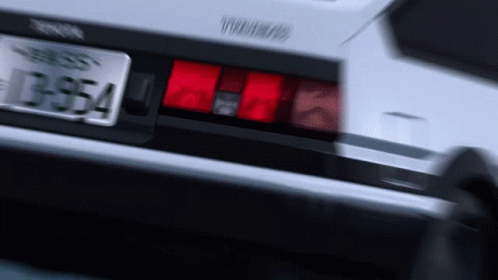

# Initial-D-Memory-Game
## Just a card flipping memory game with Initial D reference.
## HTML, CSS and, JQuery are used to make this game.

### How to try this game.
- Click on the GIF below.
- When images loads up you need click on 1 image then click on another, basically you have to find the matching pair of images.
- When you find the right pair, the matched images will be discarded and it'll left a blank space.
- Now you have to find all the pairs in order to complete the game.
- Everytime you restart the game, the order of images will be changed.
- This time 2 Hotkeys are added to change background and restart the game.
- Hotkey 1: Spacebar 
- Hotkey 2: 'R' or 'r'.

 

If you are reading this have great day :)
